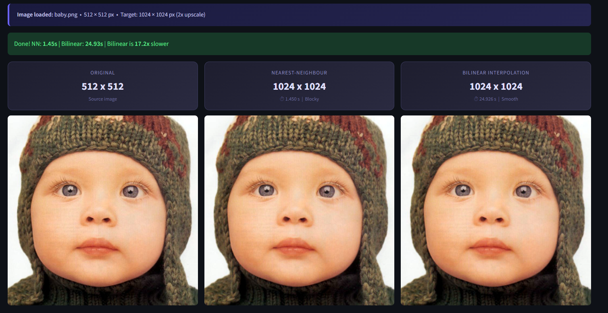

# Bilinear Interpolation - Image Rescaling System



A comprehensive, pedagogical microservices architecture that demonstrates and compares manual Nearest-Neighbour and Bilinear Interpolation algorithms for image upscaling. This tool is built from the ground up to avoid using `cv2.resize` for the core scaling, showcasing the mathematical underpinnings of digital image processing.

---

## 🏗️ Architecture

The project is decoupled into two separate microservices:

1. **FastAPI Backend (`/backend`)**
   - A headless REST API responsible for all heavy numerical computation.
   - Endpoints:
     - `GET /health` : Liveness probe.
     - `POST /upscale` : Takes an image and a scale factor, returns the upscaled base64 image and timing metrics.
     - `POST /evaluate` : Computes numerical error metrics (MSE, PSNR, MAE) between an upscaled image and a ground truth.
2. **Streamlit Frontend (`/frontend`)**
   - A modern, highly interactive web application built with Streamlit.
   - Communicates with the FastAPI backend via HTTP.
   - Features custom CSS, Lottie animations, interactive zoom inspection, and detailed error analysis reporting.

---

## ✨ Features

### Interactive Zoom Inspector
Compare the raw, un-interpolated pixels side-by-side using the detail inspector. It prevents browser auto-scaling so you can clearly see the blocky artefacts of Nearest-Neighbour versus the smooth gradients of Bilinear interpolation.


### Automated System Testing
Run deterministic tests on a 2x2 synthetic matrix to mathematically prove the correctness of the interpolation implementations, validating matrix dimensions, unique colors, and dtype outputs.

### Detailed Error Analysis
Downsample high-resolution images and then upscale them back to their original size to calculate exact numerical error metrics (MSE, PSNR, MAE).


Compare the mathematical differences visually using Absolute Error Heatmaps.


See the difference directly.


---

## 🚀 Getting Started

### Prerequisites
- Python 3.10+
- Docker and Docker Compose (optional, for containerized execution)

### Option 1: Run Locally via Makefile (Recommended)

1. **Install dependencies:**
   ```bash
   make install
   ```
2. **Run both servers concurrently:**
   ```bash
   make dev
   ```
   *This will launch the backend API on port 8000 and the frontend UI on port 8501.*

### Option 2: Run via Docker Compose

Run the entire cluster in detached mode:
```bash
make docker
```
*Or manually:* `docker-compose up --build -d`

---

## ☁️ Cloud Deployment Setup

If you are deploying this repository to external cloud providers (e.g. Render, Hugging Face, Streamlit Community Cloud), ensure you map the correct entry points since the project uses a nested directory structure:

- **Backend / API Deployment (Render / Hugging Face Spaces):**
  - Use `backend/Dockerfile` or configure the root directory to point to `/backend`.
  - The start command is: `uvicorn backend.api:app --host 0.0.0.0 --port 8000`

- **Frontend / UI Deployment (Streamlit Community Cloud):**
  - Set the "Main file path" to `frontend/app.py`.
  - In Advanced Settings, inject the secret URL pointing to your hosted backend API:
    ```toml
    API_URL = "https://your-backend-api-url.com"
    ```

---

## 🧮 How The Algorithms Work

### Nearest-Neighbour
For each destination pixel, the algorithm simply picks the closest source pixel. This is extremely fast but produces blocky, staircase-like artefacts.

### Bilinear Interpolation
Uses the area-weighted Lagrange form to blend the four surrounding integer-grid pixels. This calculates intermediate values based on spatial distance, producing smooth gradients at the cost of slightly more computational time.
---

## 🎬 Video Demonstration

You can watch the full project walkthrough and live upscaling demonstration here:
 [Google Drive Video Demo](https://drive.google.com/file/d/12rzPYZiTAC0OW5AKnk0PmZDm6WCSMdXR/view?usp=sharing)

---
